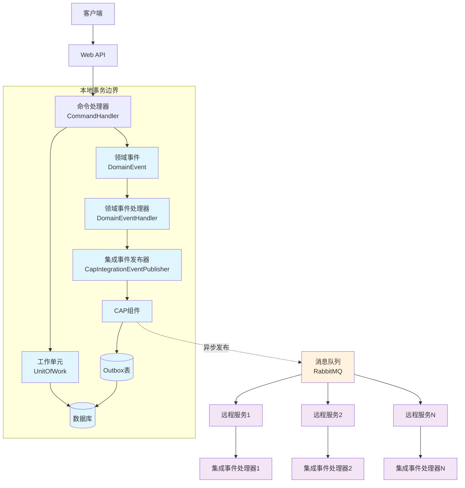
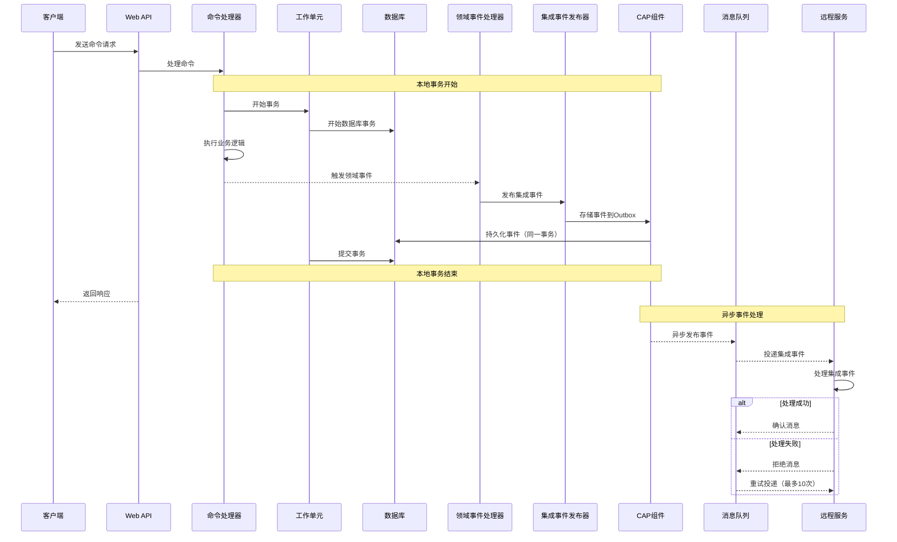
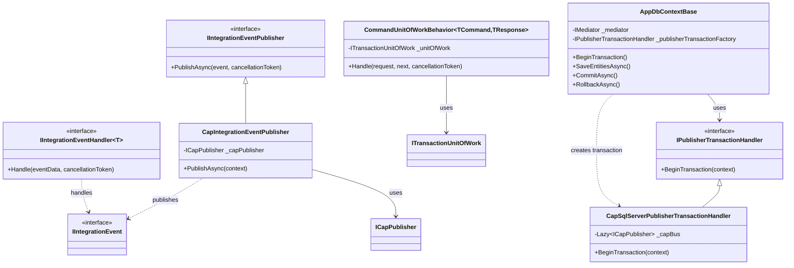
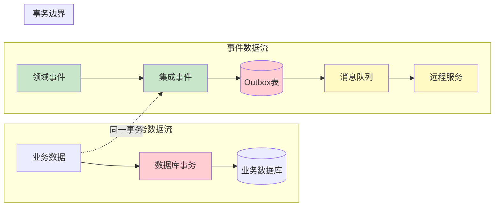

# NetCorePal 框架最终一致性架构图

## 整体架构图

## 事件处理时序图

## 核心组件关系图

## 数据流图

这些图表清楚地展示了 NetCorePal 框架如何通过 CAP 组件实现最终一致性：

1. **本地事务保证强一致性** - 业务数据和集成事件在同一事务中提交
2. **Outbox模式确保可靠性** - 事件持久化后异步发布
3. **消息队列保证投递** - 支持重试和错误处理
4. **远程服务最终一致** - 通过集成事件同步状态