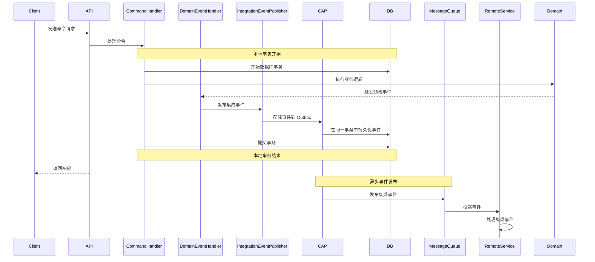

# NetCorePal 框架的最终一致性保证机制详解

## 概述

NetCorePal Cloud Framework 是一个基于 ASP.NET Core 实现的领域驱动设计（DDD）战术框架，其中最核心的特性之一是通过分布式事务机制保证微服务间的最终一致性。本文将详细解释框架如何实现最终一致性，使用了什么技术包，以及其核心原理。

## 核心技术栈

### 主要依赖包

1. **DotNetCore.CAP** - 分布式事务和集成事件的核心包
2. **MediatR** - 领域事件的本地处理
3. **Entity Framework Core** - 数据持久化和事务管理
4. **RabbitMQ** - 消息队列（通过 CAP 集成）

### 关键组件

- `IIntegrationEventPublisher` - 集成事件发布接口
- `CapIntegrationEventPublisher` - CAP 实现的事件发布器
- `IPublisherTransactionHandler` - 发布者事务处理器
- `AppDbContextBase` - 基础数据库上下文，支持工作单元模式
- `CommandUnitOfWorkBehavior` - 命令处理的工作单元行为

## 最终一致性保证机制

### 1. Outbox 模式实现

框架通过 CAP 组件实现了标准的 Outbox 模式：

```csharp
// 在 AppDbContextBase 中的事务处理
public IDbContextTransaction BeginTransaction()
{
    if (_publisherTransactionFactory != null)
    {
        // 使用 CAP 的事务处理器，确保消息和业务数据在同一事务中
        CurrentTransaction = _publisherTransactionFactory.BeginTransaction(this);
    }
    else
    {
        CurrentTransaction = Database.BeginTransaction();
    }
    return CurrentTransaction;
}
```

### 2. 数据库特定的事务处理器

框架为不同数据库提供了专门的事务处理器：

```csharp
// SQL Server 事务处理器
public class CapSqlServerPublisherTransactionHandler : IPublisherTransactionHandler
{
    private readonly Lazy<ICapPublisher> _capBus;
    
    public IDbContextTransaction BeginTransaction(DbContext context)
    {
        // 将 CAP 发布器与数据库事务绑定
        return context.Database.BeginTransaction(_capBus.Value, autoCommit: false);
    }
}
```

### 3. 集成事件发布机制

```csharp
public sealed class CapIntegrationEventPublisher : IntegrationEventPublisher
{
    readonly ICapPublisher _capPublisher;

    protected override Task PublishAsync(IntegrationEventPublishContext context)
    {
        // 通过 CAP 发布集成事件，自动参与当前数据库事务
        return _capPublisher.PublishAsync(
            name: context.Data.GetType().Name,
            contentObj: context.Data,
            headers: context.Headers,
            cancellationToken: context.CancellationToken);
    }
}
```

## 事件流转架构

### 完整的事件处理流程



### 关键步骤说明

1. **命令处理阶段**：
   - 通过 `CommandUnitOfWorkBehavior` 自动开启数据库事务
   - 执行业务逻辑，可能触发领域事件

2. **领域事件处理**：
   - 在同一事务中处理领域事件
   - 领域事件处理器可以发布集成事件

3. **集成事件持久化**：
   - 集成事件通过 CAP 存储到数据库的 Outbox 表
   - 与业务数据在同一事务中提交

4. **异步事件发布**：
   - CAP 异步扫描 Outbox 表
   - 将事件发布到消息队列（如 RabbitMQ）

5. **远程服务处理**：
   - 远程服务消费集成事件
   - 支持失败重试机制

## 代码示例

### 1. 领域事件定义

```csharp
// 领域事件
public record OrderCreatedDomainEvent(OrderId OrderId) : IDomainEvent;

// 集成事件
public record OrderCreatedIntegrationEvent(OrderId OrderId) : IIntegrationEvent;
```

### 2. 领域事件处理器

```csharp
public class OrderCreatedDomainEventHandler : INotificationHandler<OrderCreatedDomainEvent>
{
    private readonly IIntegrationEventPublisher _integrationEventPublisher;

    public OrderCreatedDomainEventHandler(IIntegrationEventPublisher integrationEventPublisher)
    {
        _integrationEventPublisher = integrationEventPublisher;
    }

    public async Task Handle(OrderCreatedDomainEvent notification, CancellationToken cancellationToken)
    {
        // 在领域事件处理器中发布集成事件
        var integrationEvent = new OrderCreatedIntegrationEvent(notification.OrderId);
        await _integrationEventPublisher.PublishAsync(integrationEvent, cancellationToken);
    }
}
```

### 3. 集成事件处理器

```csharp
[CapSubscribe("OrderCreatedIntegrationEvent")]
public class OrderCreatedIntegrationEventHandler : IIntegrationEventHandler<OrderCreatedIntegrationEvent>
{
    private readonly IMediator _mediator;

    public OrderCreatedIntegrationEventHandler(IMediator mediator)
    {
        _mediator = mediator;
    }

    public async Task Handle(OrderCreatedIntegrationEvent eventData, CancellationToken cancellationToken)
    {
        // 处理来自其他服务的集成事件
        var command = new ProcessOrderCommand(eventData.OrderId);
        await _mediator.Send(command, cancellationToken);
    }
}
```

### 4. 服务注册配置

```csharp
// 在 Program.cs 中配置服务
builder.Services.AddIntegrationEventServices(typeof(Program))
    .UseCap(typeof(Program))
    .AddIIntegrationEventConverter(typeof(Program))
    .AddContextIntegrationFilters()
    .AddEnvIntegrationFilters();

// 配置 CAP
builder.Services.AddCap(x =>
{
    x.UseEntityFramework<ApplicationDbContext>();
    x.UseRabbitMQ(p => builder.Configuration.GetSection("RabbitMQ").Bind(p));
    x.UseDashboard();
});

// 配置数据库特定的事务处理器
builder.Services.AddMySqlTransactionHandler(); // 或 AddSqlServerTransactionHandler()
```

## 一致性保证

### 1. 强一致性保证

- **本地事务内**：领域事件处理在同一数据库事务中执行，保证强一致性
- **Outbox 模式**：集成事件与业务数据在同一事务中持久化，避免数据不一致

### 2. 最终一致性保证

- **可靠投递**：CAP 确保已持久化的事件最终会被发布到消息队列
- **重试机制**：集成事件处理失败时会自动重试（默认 10 次）
- **幂等性**：事件处理器需要设计为幂等的，以处理重复消息

### 3. 错误处理

```csharp
// 在 AppDbContextBase 中的错误处理
public async Task<bool> SaveEntitiesAsync(CancellationToken cancellationToken = default)
{
    try
    {
        await SaveChangesAsync(cancellationToken);
        await _mediator.DispatchDomainEventsAsync(this, 0, cancellationToken);
        await CommitAsync(cancellationToken);
        return true;
    }
    catch
    {
        await RollbackAsync(cancellationToken);
        throw;
    }
}
```

## 监控和可观测性

框架集成了多种监控能力：

1. **DiagnosticListener**：记录事务、命令、事件处理的生命周期
2. **OpenTelemetry**：分布式链路追踪
3. **SkyWalking**：APM 监控
4. **CAP Dashboard**：集成事件监控面板

## 最佳实践

### 1. 事件设计

- 集成事件应该包含最小必要信息
- 事件名称应该清晰表达业务含义
- 支持 JSON 序列化和反序列化

### 2. 幂等性处理

```csharp
public class PaymentProcessedEventHandler : IIntegrationEventHandler<PaymentProcessedEvent>
{
    public async Task Handle(PaymentProcessedEvent eventData, CancellationToken cancellationToken)
    {
        // 检查是否已处理过该事件
        var existingOrder = await _orderRepository.GetByPaymentIdAsync(eventData.PaymentId);
        if (existingOrder?.Status == OrderStatus.Paid)
        {
            return; // 已处理，直接返回
        }
        
        // 处理事件...
    }
}
```

### 3. 错误监控

- 利用框架提供的诊断信息监控事件处理性能
- 设置合适的重试策略和死信队列
- 监控 CAP Dashboard 中的事件处理状态

## 总结

NetCorePal Cloud Framework 通过以下机制确保分布式系统的最终一致性：

1. **技术选型**：使用 DotNetCore.CAP 作为核心的分布式事务处理组件
2. **模式实现**：通过 Outbox 模式确保事件的可靠持久化和发布
3. **事务协调**：通过数据库特定的事务处理器实现事件与业务数据的原子性操作
4. **重试机制**：内置的失败重试和错误处理机制
5. **监控能力**：完善的可观测性支持，便于问题排查和性能优化

这种架构设计既保证了单个服务内的强一致性，又通过异步事件机制实现了服务间的最终一致性，是微服务架构中处理分布式事务的经典解决方案。